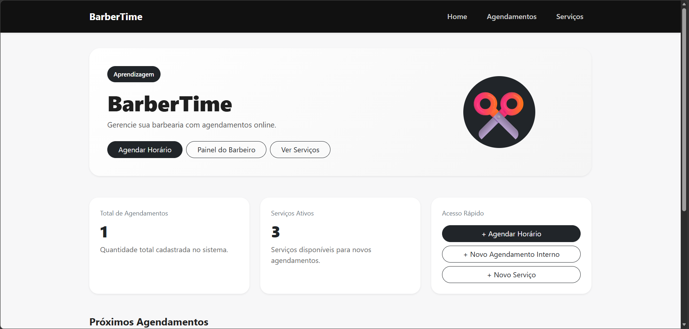
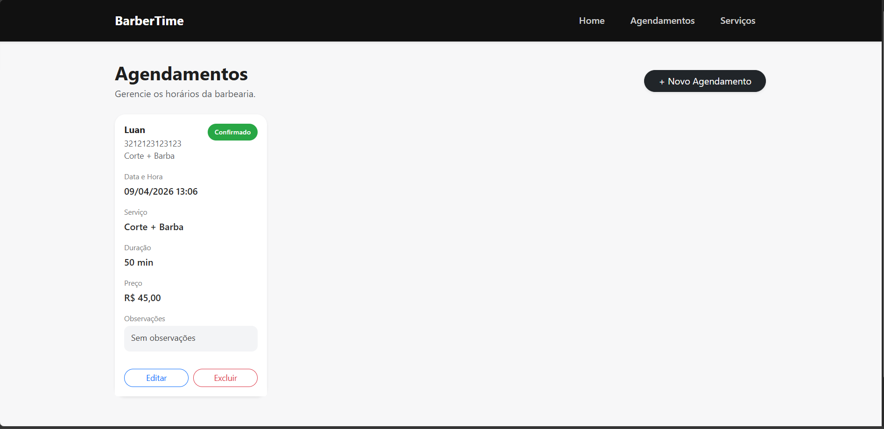
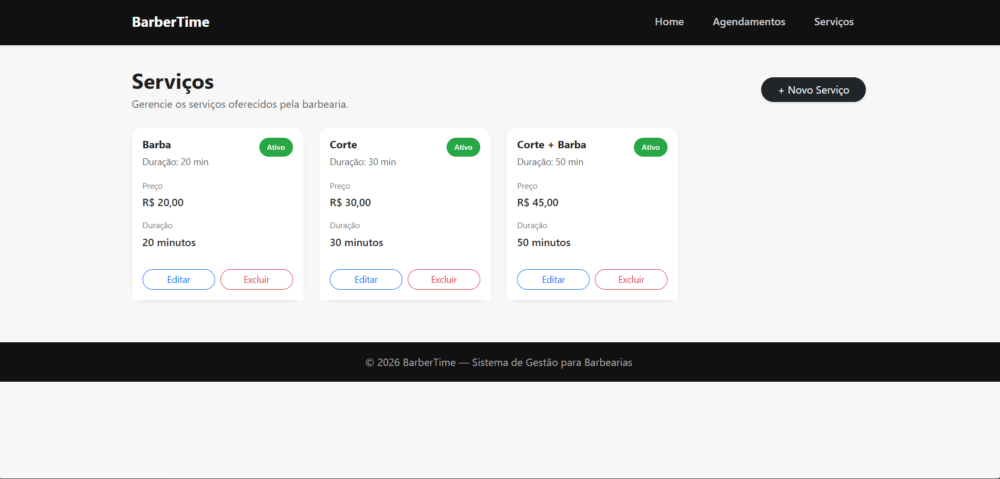
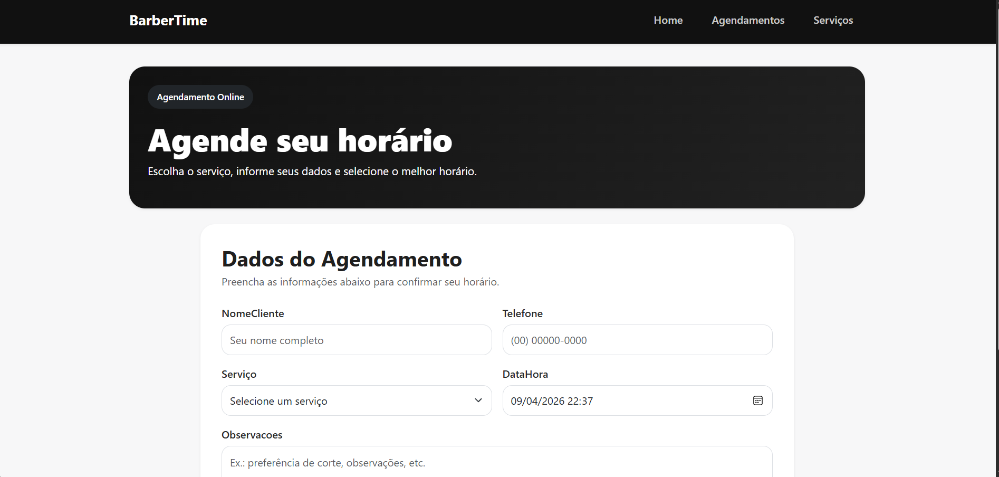

# BarberTime

Sistema web de agendamento para barbearias desenvolvido com ASP.NET Core MVC, permitindo gerenciamento completo de agendamentos e serviços, além de uma área pública para clientes realizarem reservas online.

---

## Telas
> 
> 
> 
> 

---

## Funcionalidades

### Área Pública

* Agendamento online 
* Seleção de serviço
* Escolha de data e horário
* Validação de horários indisponíveis
* Tela de confirmação de agendamento

### Painel do Barbeiro

* Mérticas iniciais
* Visualização de próximos agendamentos
* CRUD completo de agendamentos
* Alteração de status do atendimento
* Gestão de serviços da barbearia

### Regras de Negócio

* Bloqueio de horários sobrepostos
* Validação de duração do serviço
* Bloqueio de datas passadas
* Bloqueio de domingos
* Restrição de horário de funcionamento
* Serviços inativos não aparecem para novos agendamentos

---

## Tecnologias Usadas

* ASP.NET Core MVC
* C#
* Entity Framework Core
* PostgreSQL
* Bootstrap 5
* HTML / CSS / Razor Views

---

##  Conceitos que pude trabalhar

* Arquitetura MVC
* ORM com Entity Framework Core
* Migrations
* Relacionamentos entre entidades
* Validações 
* Layout responsivo 
* Regras de negócio de agenda real

---

## Para Executar

### Clone o repositório


git clone https://github.com/SEU-USUARIO/BarberTime.git


### Entrar na pasta do projeto

cd BarberTime

### 3. Configure a connection string

No arquivo appsettings.json, configure sua conexão PostgreSQL:

```json
"ConnectionStrings": {
  "DefaultConnection": "Host=localhost;Port=5432;Database=barbertime_db;Username=postgres;Password=
}
```

### Faça as migrations

dotnet ef database update

### Rodar

dotnet run

---

Desenvolvido por **Luan**. Projeto criado para prática e portfólio de desenvolvimento back-end / full stack.
